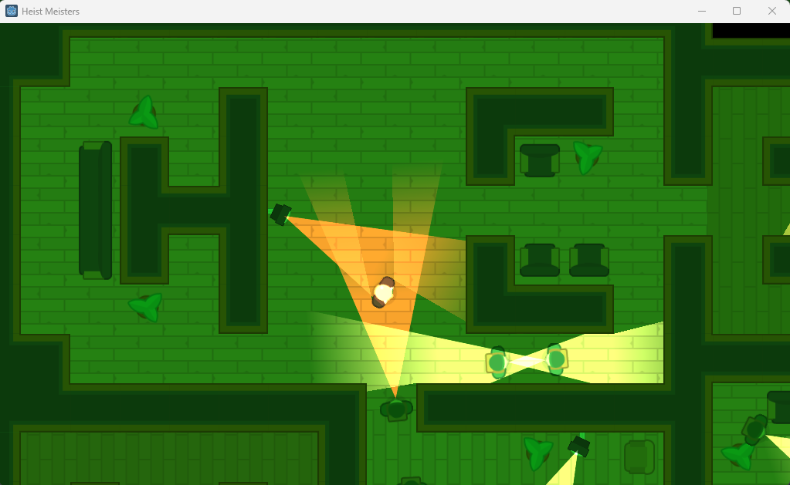
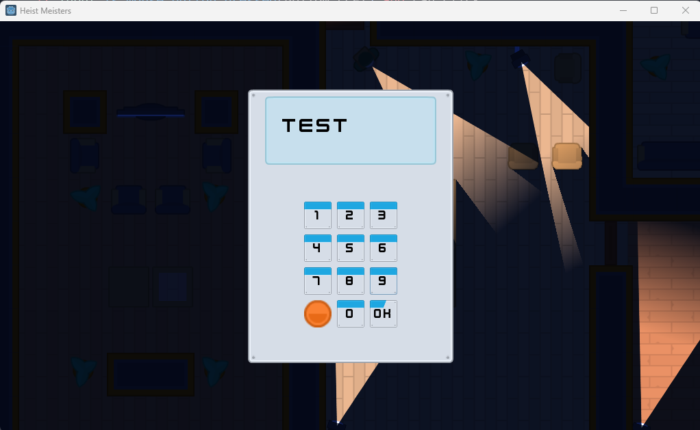
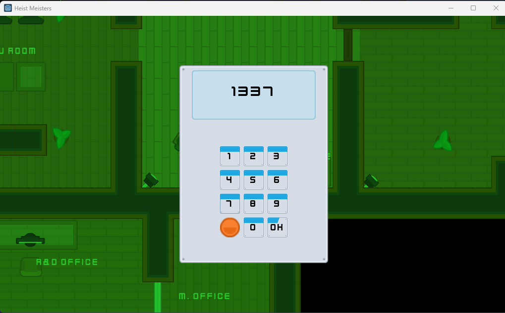
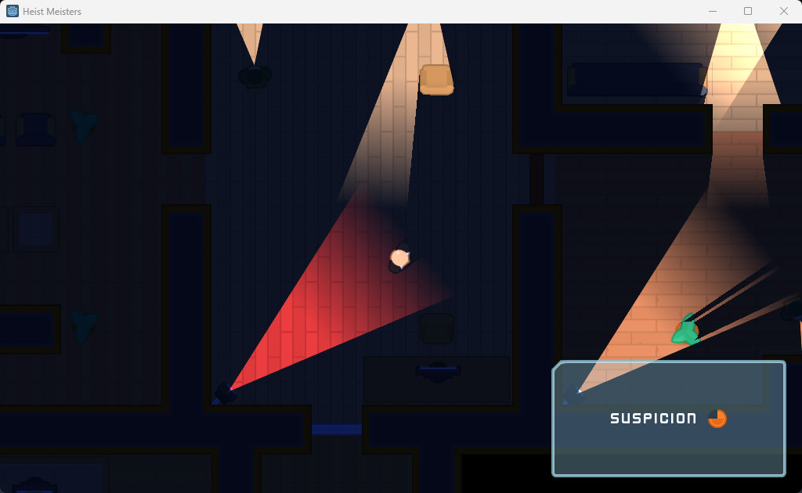
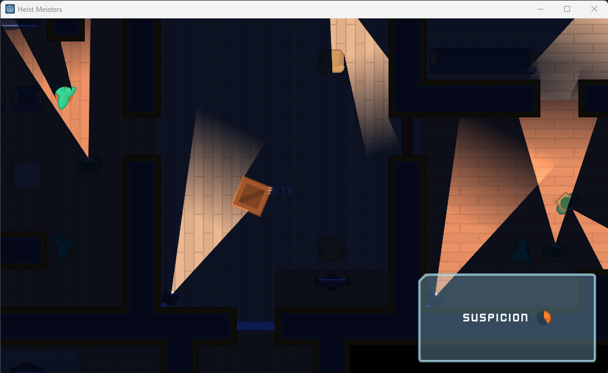
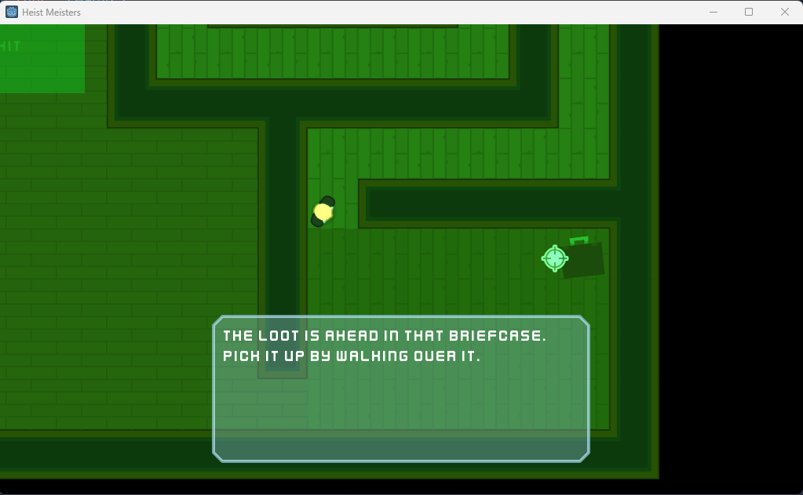

# Heist Meisters

Project from Discovering Godot

Godot version: Godot_v3.0.4

## Progress

- [x] NightVision 

- [x] LockedDoor NumberPad 

- [x] Computer, Locked Doors and Map Labels 

- [x] GUI - Suspicion Container

- [x] Disguises Risk

- [x] Tutorial Scene
